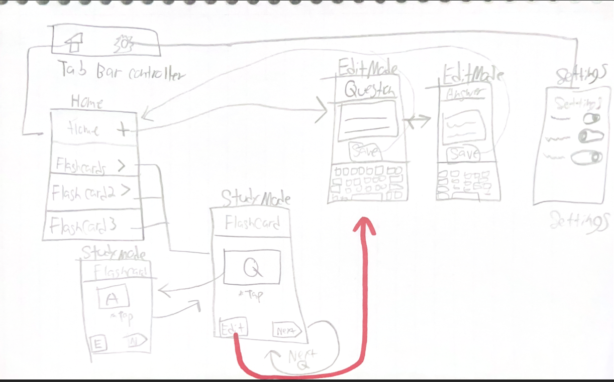

# Flash Card App

## Table of Contents

1. [Overview](#Overview)
2. [Product Spec](#Product-Spec)
3. [Wireframes](#Wireframes)
4. [Schema](#Schema)

## Overview

### Description

Create and organize your own flashcards in just a few taps. Whether you’re studying languages, facts, or trivia, our app makes it easy to build, edit and review personalized decks all on the go.

**Key Features**

-Create unlimited flashcards and save them for later

-Organize cards into custom groups or subjects

-Edit or delete any card or group at any time

-Shuffle your deck for a fresh, randomized study session whenever you hit “Study”

### App Evaluation

[Evaluation of your app across the following attributes]
- **Category:** Education / Productivity
- **Mobile:** Mobile could be essential for this because when studying on the go or in a space where a laptop or PC is not available, users can just go on the app and start using one of the ones they created. Plus, you won’t need to carry a big pile of physical flashcards if you want to study on the go; it's all in the palm of your hand.  
- **Story:** When a student needs to study last minute for an exam, he can pull out his phone and start studying while on his commute to school or while eating.  
- **Market:** More leaning towards students—the Flashcard app is marketed as a simpler, more clean way to go about flashcard studying.
- **Habit:** An average user might use my app daily if he or she so chooses to study. Realistically, a person might use this app in huge spur-of-the-moment sessions throughout the year such as midterm and finals week, so app may be dormant for 1–2 months but used daily for 1–2 weeks, with this cycle repeating.  
- **Scope:** For me it might be technically challenging making sure that all user-saved cards are stored in their location. I can use what we did for the To Do List app to separate the cards into separate groups, and when selecting a group, only the cards in that group would be used for studying. The stripped down version could still be cool—making sure the cards are stored and finding a way to reorganize the cards in a random way while still making sure the Question and Answer don't separate could be a challenge for me at least.  

## Product Spec

### 1. User Stories (Required and Optional)

**Required Must-have Stories**

* User can create new "family" of Flash Cards
* User can create a new Flashcard - Flash Card consists of Question & Answer
* User can add Flashcard's to the "family" of flash cards
* User can edit and delete Flashcards 
* User can edit and delete "family" of flashcards 
* User's can enter study mode and tap on the screen to see answer of question
* User's Flashcards will be saved localy for offline use.

**Optional Nice-to-have Stories**

* User can edit color sceme per family of Flash Cards 
* User can randomize the order Flashcards apear in

### 2. Screen Archetypes

## 2. Screen Archetypes

- **Deck List Screen**  
  *Shows all “families” of flash cards*  
  - **Required Stories:**  
    - User can create new family of Flash Cards  
    - User can edit and delete families  
    - User’s flashcards are saved locally for offline use  

- **Family Detail (Card List) Screen**  
  *Shows all cards in a selected family*  
  - **Required Stories:**  
    - User can add Flashcards to the family  
    - User can edit and delete individual Flashcards  

- **Card Edit/Create Screen**  
  *Form for entering Question & Answer*  
  - **Required Stories:**  
    - User can create a new Flashcard (question + answer)  
    - User can edit an existing Flashcard  

- **Study Screen**  
  *Review mode for one card at a time*  
  - **Required Stories:**  
    - User can shuffle their deck and tap “Next” to see the next card  
  - **Optional Stories:**  
    - User can randomize the order Flashcards appear in  

## 3. Navigation

#### Tab Navigation  
*(Bottom tab bar with two tabs)*  
1. **Decks** → Deck List Screen  
2. **Settings** → Settings Screen (Optional currently [Color])  

> *(We keep Settings minimal—just a global color-scheme picker. All core functionality lives under “Decks.”)*  

#### Flow Navigation  
- **Deck List Screen**  
  - **Tap “＋”** → Card Edit/Create Screen in “New Family” mode  
  - **Tap a family row** → Family Detail Screen  

- **Family Detail Screen**  
  - **Tap “＋”** → Card Edit/Create Screen in “New Card” mode  
  - **Tap a card row** → Card Edit/Create Screen in “Edit Card” mode  
  - **Tap “Study” button** → Study Screen  

- **Study Screen**  
  - **Swipe or “Next”** → show next card in (shuffled) order  
  - **“Done”** → back to Family Detail Screen  

- **Settings Screen**  
  - **Select color** → apply selection to all families (or store per-family if implemented)  
  - **Back** → remain on Settings tab (no further flows)  

## Wireframes

### [BONUS] Digital Wireframes & Mockups

### [BONUS] Interactive Prototype

## Schema 

[This section will be completed in Unit 9]

### Models

[Add table of models]

### Networking

- [Add list of network requests by screen ]
- [Create basic snippets for each Parse network request]
- [OPTIONAL: List endpoints if using existing API such as Yelp]# Brandon-Capstone-App

